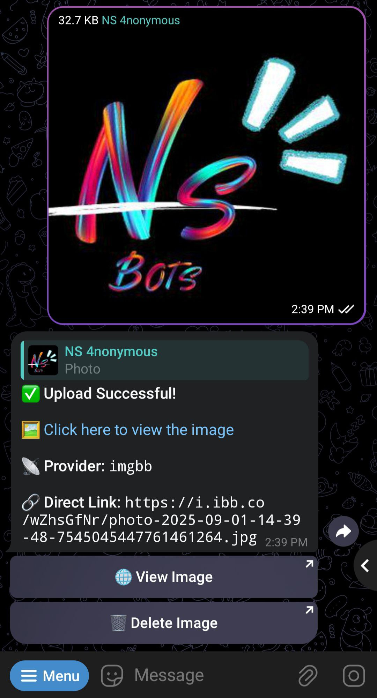
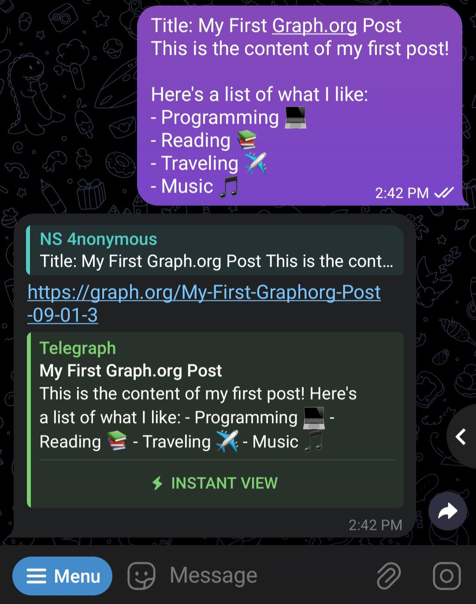
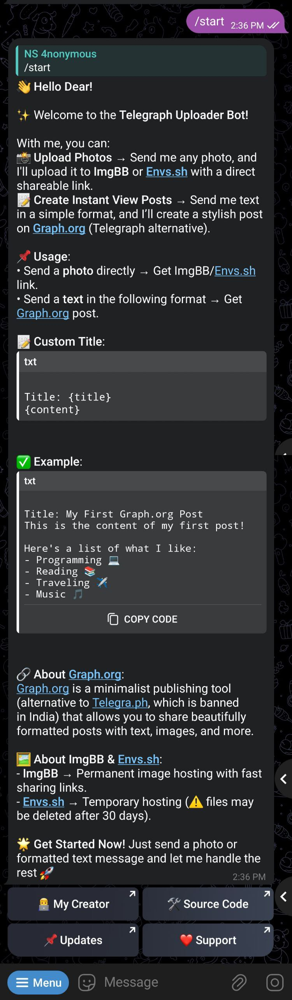

# 📤 Telegraph-Uploader

[](https://github.com/Ns-AnoNymouS/Telegraph-Uploader)
[](https://telegram.dog/Ns_AnoNymouS)

**Telegraph-Uploader** is a **Telegram bot** that helps you upload **photos** and create **instant-view posts**.  
Since **Telegra.ph is banned in India**, this bot uses **Graph.org** for posts and **ImgBB/Envs.sh** for image hosting.

---

## ✨ Features

- 🔗 **Instant View Links** → Generate instant-view links for Telegram text messages.
- 🏞 **Photo Uploads** → Upload photos to **ImgBB** (permanent) or **Envs.sh** (temporary, 30 days).
- 📝 **Custom Titles** → Add custom titles when creating Graph.org posts.
- ⚡ **Fast & Lightweight** → Powered by [Pyrogram](https://docs.pyrogram.org/).

---

## 📷 Features & Examples

### 🖼️ Upload Photo



---

### 📰 Graph.org Post



---

### 🤖 Bot Start Menu



---

## 🚀 Easy Deployment

[](https://heroku.com/deploy?template=https://github.com/Ns-AnoNymouS/Telegraph-Uploader)

1. Get your **API HASH** & **API ID** from [my.telegram.org](https://my.telegram.org/auth?to=apps).
2. Get your **Bot Token** from [@BotFather](https://t.me/BotFather).
3. (Optional but recommended) Get an **ImgBB API Key** from [ImgBB](https://api.imgbb.com/).

---

## 🖥️ Run Locally

1. Clone the repository:

   ```sh
   git clone https://github.com/Ns-AnoNymouS/Telegraph-Uploader.git
   cd Telegraph-Uploader
   ```

2. Create a virtual environment:

   ```sh
   python3 -m venv .venv

   # Windows
   .venv\Scripts\activate

   # Linux / MacOS
   source .venv/bin/activate
   ```

3. Install dependencies:

   ```sh
   pip3 install -r requirements.txt
   ```

4. Configure your `.env` file:

   ```env
   API_HASH = "your_api_hash"
   API_ID = "your_api_id"
   BOT_TOKEN = "your_bot_token"

   # ImgBB (permanent hosting). If not set, bot uses Envs.sh (⚠️ expires in 30 days).
   IMGBB_API_KEY = "your_imgbb_api_key"
   ```

5. Start the bot:

   ```sh
   python3 main.py
   ```

---

## 📜 Commands

```bash
/start - Check bot status & usage instructions
```

---

## 🤔 Usage

- **Photo Upload** → Send any photo.

  - ✅ If **IMGBB_API_KEY** is set → uploads to **ImgBB** (permanent).
  - ⚠️ If not → uploads to **Envs.sh** (expires after 30 days).

- **Text to Instant View** → Send text in the format below:

  ```txt
  Title: My First Post
  This is the content of my Graph.org post.
  ```

- **Custom Titles** → Add a title for every post.

---

## 🛠 Built With

- [Python](https://docs.python.org/) 🐍
- [Pyrogram](https://docs.pyrogram.org/) 📡
- [Graph.org API](https://graph.org/api) ✨
- [ImgBB API](https://api.imgbb.com/) 🖼️

---

## 👨🏻‍💻 Developer

[](https://github.com/Ns-AnoNymouS)

**Name**: Naveen Kumar  
**GitHub**: [Ns-AnoNymouS](https://github.com/Ns-AnoNymouS)  
**Telegram**: [NS AnoNymouS](https://telegram.dog/The_proGrammerr)

---

## 🤝 Contributions

Contributions are always welcome! 🎉
Fork the repo, create a branch, and submit a PR.

---

## ⚠️ Notes

- 🖼️ **ImgBB** → Permanent hosting.
- 🗑️ **Envs.sh** → Temporary hosting (deleted after 30 days).
- 🇮🇳 Since **Telegra.ph is banned in India**, this bot uses **Graph.org** instead.

---
